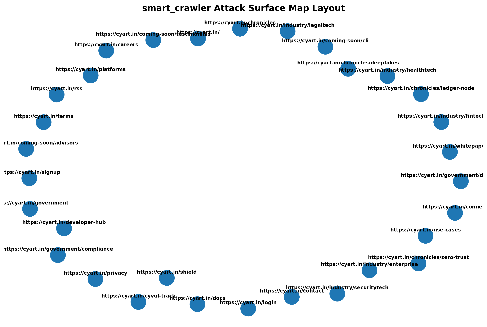

# smart_crawler
# SMART_CRAWLER

`SMART_CRAWLER` is a Python-based security tool designed to crawl target websites, map out their endpoints, and visually construct an **Attack Surface Map**. By analyzing the relationship between discovered URLs, it generates web graphs that help security professionals and developers identify exposed directories, third-party integrations, and potential points of vulnerability.

---

## 📁 Project Structure

The project is organized as follows:

```text
SMART_CRAWLER/
│
├── .venv/                  # Python virtual environment
├── output/                 # Generated scan results and attack surface visualizations
├── smart_crawler.egg-info/ # Metadata for package installation
│
├── config.py               # Configuration settings (e.g., target domains, limits, headers)
├── crawler.py              # Logic for crawling pages and extracting URLs
├── graph_builder.py        # Maps connections and builds network graph layouts (NetworkX/Matplotlib)
├── main.py                 # Core application entry point
├── parser.py               # HTML/data parsing utility
├── store.py                # Database or local file storage handling for crawled data
├── utils.py                # Generic helper functions
│
├── .gitignore              # Version control ignore rules (hides .venv, cache, and large outputs)
├── pyvenv.cfg              # Virtual environment configuration
├── README.md               # Project documentation
├── requirements.txt        # Third-party dependencies
└── setup.py                # Package installation configuration

1. Prerequisites
Python 3.8+ installation

2. Installation & Setup
Clone/navigate repository to project directory, then virtual environment activation and required dependencies to be installed:

Bash
# Windows (PowerShell)
.\.venv\Scripts\Activate.ps1

# Windows (CMD)
.\.venv\Scripts\activate.bat

# Linux/macOS
source .venv/bin/activate

# Install dependencies
pip install -r requirements.txt
3. Usage
Configure your target settings inside config.py and kick off the crawler by executing the main script:

Bash
python main.py

Output & Attack Surface Map
The crawler outputs map data and layout visualizations to the output/ directory.

The generated layout charts provide a high-level overview of an organization's external footprint. Nodes represent unique discovered URLs, and edges indicate direct paths or linkages found during the crawl phase.

Built With
Python - Core application logic.

BeautifulSoup4 / Scrapy (via parser.py) - HTML parsing and link extraction.

NetworkX & Matplotlib (via graph_builder.py) - Network topology map plotting and rendering.

### 💡 Tips for Customization:
* If specific libraries are used for database storage in `store.py` (like SQLite) or specialized tools in `crawler.py` (like `playwright` or `requests`), can add them to the **Built With** section.

## Output & Attack Surface Map

The crawler outputs map data and layout visualizations to the `output/` directory.

### Attack Surface Topology

